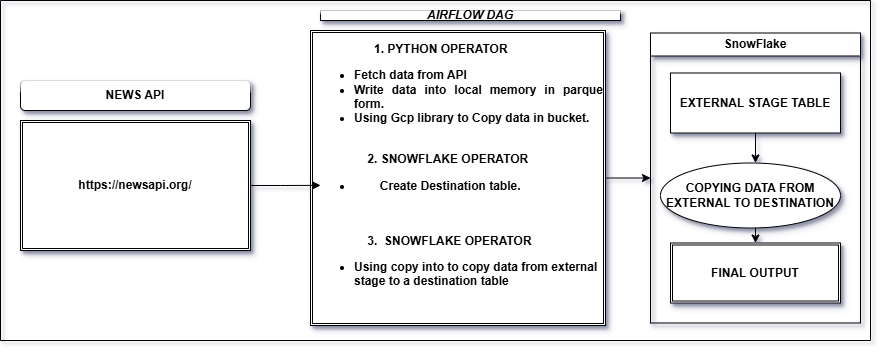

# News-Data-Analysis-Project

   
   
   

## PROJECT OVERVIEW

The project automates the process of fetching news articles related to Tesla from the News API, processing this data, and storing it in Google Cloud Storage (GCS) as a Parquet file. This file is later moved to a Snowflake data warehouse for analysis. The project uses Airflow for orchestration, ensuring the data ingestion and processing occur periodically and smoothly.

  

### PROJECT EXPLANATION :-  

  
  
  
   
   
      

     

  

 
 
 

## ARCHITECTURE DIAGRAM :-

  

 
 
 

## TECHNOLOGY USED :-

<h3>Airflow:</h3>

Orchestrates the entire workflow by defining tasks that automate fetching, processing, saving, and uploading data.

<h3>Python:</h3>

Used for scripting the logic for data fetching, processing, and file handling.

<h3>News API:</h3>

Provides news data based on search queries. It offers access to various news articles, including their metadata, such as title, author, and content.

<h3>Pandas:</h3>

A Python library used to handle the structured data (articles) in a DataFrame, process it, and save it to disk in a columnar format (Parquet).

<h3>Google Cloud Storage (GCS):</h3>

A cloud storage service where the processed Parquet files are stored temporarily before being ingested into Snowflake.

<h3>Snowflake:</h3>

Data warehouse that will eventually store and analyze the news data once it's transferred from GCS.

 
 
 

## Script Files  :-
* <h3>Python-File:</h3>
[Python-code-snippet](prac2.py)
  
  
 
 * <h3>Airflow-Dag : </h3>
  [Airflow-Dag-file](airflowjobprac.py)

   
   
  
## Resulted output :- 

<h3>Result in datetime format</h3>

 - <h3>Output_link_1 :</h3>
  [Result1](https://github.com/aadarsh786/News-Data-Analysis-Project/blob/main/SNOWFLAKE_PROJECT_PARQUET_FILES_run_20241105064621.parquet)

 - <h3>Output_link_2 :</h3>
  [Result2](https://github.com/aadarsh786/News-Data-Analysis-Project/blob/main/SNOWFLAKE_PROJECT_PARQUET_FILES_run_20241105064940.parquet)

